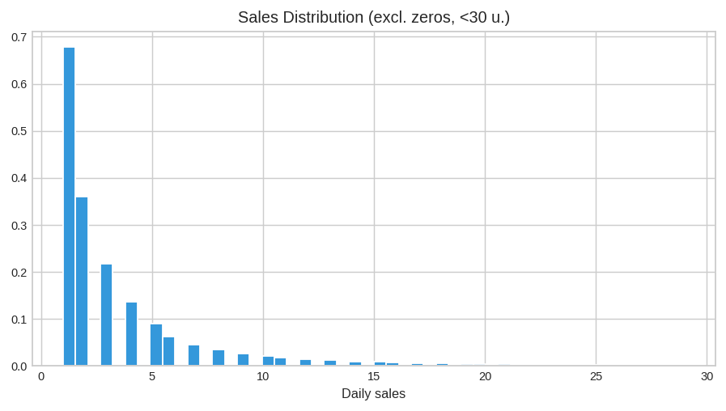
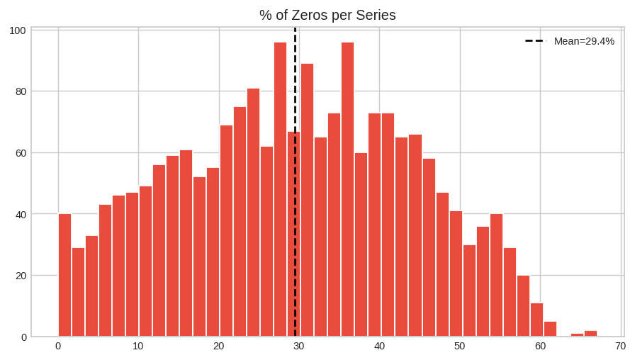
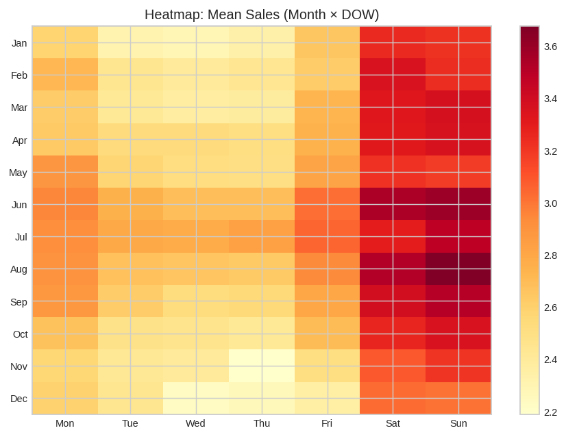
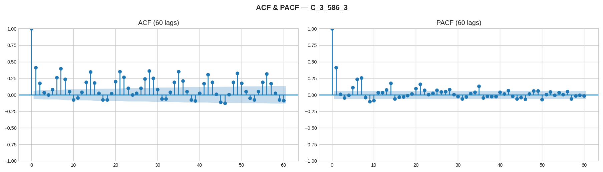
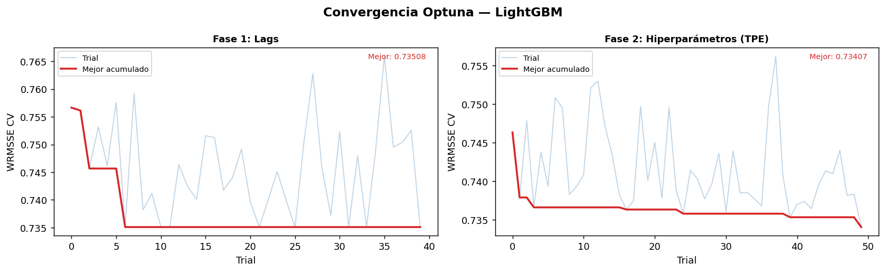
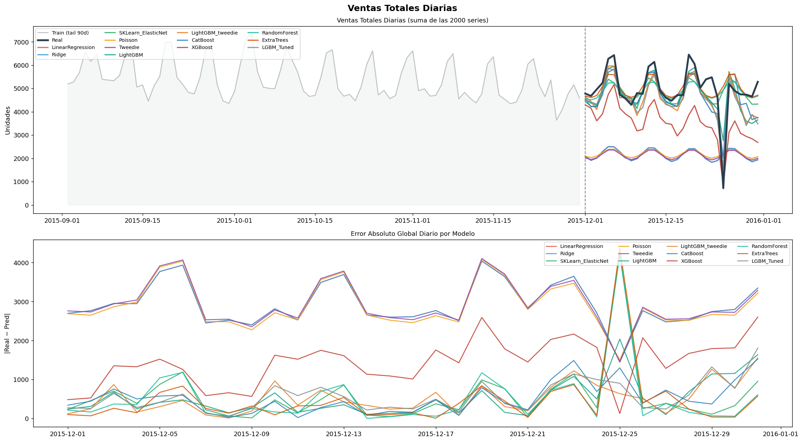

# Retail Demand Forecasting — 2,000 Time Series, 31-Day Horizon

Forecasting daily unit sales for **500 products across 4 stores** (2,000 product–store
series) one month ahead, with a single **global** gradient-boosting model.

Roughly **30% of the daily values are zero**, which makes the choice of evaluation
metric the first real modelling decision — and the one that ended up driving every
other decision in the project. Ranking is on **WRMSSE**, the metric used by the
[M5 Forecasting Competition](https://www.sciencedirect.com/science/article/pii/S0169207021001874):
each series is scaled by its own seasonal-naive error, then weighted by its share of
recent sales volume.

**Best model: LightGBM (Tweedie objective, Optuna-tuned) — WRMSSE₇ 0.7717** on a
held-out December, against 13 competing models.

<p align="left">


</p>

---

## The problem

Given three years of daily sales history (2013-01-01 → 2015-12-31), forecast the
daily unit sales of every product in every store for **January 2016** — a 31-day
horizon across 2,000 series, so 62,000 individual predictions.

The forecast feeds per-store stock allocation. That matters more than it sounds: it
is what makes a unit of error on a product selling 40/day worth more than the same
error on one selling 0.4/day, and it is the reason the ranking metric is
volume-weighted rather than a plain average.

## The data

| File | Shape | Contents |
|---|---|---|
| `data/sales.csv` | 2,000 × 1,100 | Wide format — 5 metadata columns + 1,095 daily columns |
| `data/prices.csv` | 2,252,000 × 4 | `snapshot_date`, `product_id`, `store_id`, `price` |
| `data/preprocessed_data.parquet` | 2,190,000 × 12 | Long format with prices joined — produced by notebook 1, consumed by notebook 2 |

Product, sub-category and store identifiers are pseudonymous in the source
(`A_1_008`, store `1`…`4`). There is no personal data of any kind.

Melted to long format the panel is **2.19M observations**, and the price join leaves
**zero nulls** — so there is no missing-value strategy to defend, and the interesting
properties are all distributional:

| Statistic | Value |
|---|---|
| Mean / median daily sales | 2.805 / 1.0 |
| Std | 5.536 |
| P25 / P75 / P99 | 0 / 3 / 26 |
| Max | 356 |
| **Zeros** | **29.44%** (up to 65% on the sparsest series) |
| Skewness / kurtosis | 7.59 / 122.44 |
| Gini across series totals | 0.514 |

<p align="center">


</p>

**What the EDA established**, each of which became a modelling decision:

- **Weekly seasonality** — peak Sunday, then Saturday and Monday; trough Thursday.
- **Annual seasonality** — peak June–July, trough December.
- **Christmas Day is the global minimum every single year** (719 / 745 / 721 units in
  2013 / 2014 / 2015). It earned its own binary covariate.
- **ACF/PACF** significant at lags 1, 2, 7, 14, 21, 28, 35, 42, 49, 56, with structure
  out to ~120 days.
- **Segment effects** — category C sells most, and most of all in store 3
  (5.476 units/day) against category B in store 4 at the bottom (0.961).
- **Price** shows a weak negative relationship with units (Pearson r = **-0.196** on
  non-zero sales) — worth including as an exogenous variable, not as a primary
  predictor.

<p align="center">


</p>

## Approach

### One global model, not 2,000 local ones

Categories and stores share shape while differing in level, so fitting a classical
local model per series (ARIMA / ETS / Theta / Croston) was rejected on two grounds: it
cannot borrow strength across series — which is exactly what the sparse products need,
having almost no signal of their own — and 2,000 fitted objects is an operational
liability. Every model here is **global**: one fit, 2,000 series.

Framework: **[Darts](https://unit8co.github.io/darts/)**, with scikit-learn estimators
wrapped in `SKLearnModel` where Darts has no native equivalent.

### Split protocol

Strictly chronological, no shuffling:

| Split | Range | Length | Used for |
|---|---|---|---|
| Train | 2013-01-01 → 2015-11-30 | 1,064 days | Fitting every ranked model |
| Test | 2015-12-01 → 2015-12-31 | 31 days | The ranking table below |
| CV-train | 2013-01-01 → 2015-10-31 | 1,034 days | Optuna only |
| CV-val | 2015-11-01 → 2015-11-30 | 30 days | Optuna objective |

The test horizon is 31 days — identical to the real task — so the evaluation
reproduces the deployment condition rather than an easier one.

### Covariates, partitioned by when they become knowable

This is the distinction that matters in forecasting, and getting it wrong produces a
*better* score and a model that cannot be run in production:

- **Future covariates (10)** — sine/cosine encodings of day-of-week, month and
  day-of-year, plus `is_weekend`, `month_norm`, a linear `trend` and `is_xmas`. All
  computable for January 2016 in advance.
- **Past covariates (1)** — **price**, deliberately *past* rather than future, because
  next month's price list is not known when the forecast is made.
- **Static covariates (10)** — one-hot `cat_id`, `store_id`, `subcat_id`, letting one
  global model condition on segment identity.

Series are transformed with `log1p` and a per-series scaler chained in a Darts
`Pipeline` **fitted on train only**; predictions are inverse-transformed and clipped at
zero. Tree ensembles train on the raw scale, since monotone transforms do not change
their splits.

### Metrics

Ranking is on **WRMSSE₇** — RMSSE with a lag-7 seasonal-naive denominator, weighted by
each series' share of units over the last 28 training days. WRMSSE and RMSSE (lag-1)
reproduce the official M5 definitions; MASE, MAE, RMSE, RMSLE, sMAPE and OPE are
recorded as diagnostics.

Two properties are worth stating explicitly:

1. **The baseline lives inside the metric.** RMSSE < 1 means the model beats a
   seasonal naive. It is not decorative — four of the fourteen models score above 1.
2. **sMAPE is refused as a ranking metric**, because it destabilises when actual and
   predicted are both near zero — which, at a 29.4% zero rate, is most of the data. It
   is reported and then set aside.

### Hyperparameter optimisation

Two sequential Optuna studies (TPE, multivariate) on a **400-series stratified
subsample** (20%, stratified by category × store), scored by WRMSSE on the November
validation window:

| Phase | Trials | Searched | Best CV WRMSSE |
|---|---|---|---|
| 1 — lag structure | 40 | Which lag groups to include, plus the past-covariate lag set | 0.73508 |
| 2 — hyperparameters | 50 | `num_leaves`, `max_depth`, learning rate, L1/L2, `min_child_samples`, subsample, colsample, Tweedie power | 0.73407 |

<p align="center"></p>

## Results

Test set: December 2015, all 2,000 series × 31 days, ranked by WRMSSE₇.

| # | Model | WRMSSE₇ | WRMSSE | RMSSE₇ | MASE | MAE | RMSLE |
|---|---|---|---|---|---|---|---|
| 1 | **LightGBM tuned (Tweedie)** | **0.7717** | 0.7978 | 0.7078 | 0.7817 | 1.5722 | 0.5781 |
| 2 | LightGBM (Tweedie, hand-set) | 0.7861 | 0.8117 | 0.7137 | 0.7908 | 1.5938 | 0.5846 |
| 3 | LightGBM (L2) | 0.7920 | 0.8181 | 0.7212 | 0.8060 | 1.6364 | 0.6017 |
| 4 | CatBoost (Tweedie) | 0.7931 | 0.8188 | 0.7196 | 0.8009 | 1.6240 | 0.5970 |
| 5 | XGBoost (L2) | 0.7986 | 0.8247 | 0.7235 | 0.8112 | 1.6516 | 0.6075 |
| 6 | RandomForest | 0.8068 | 0.8331 | 0.7280 | 0.8176 | 1.6633 | 0.6184 |
| 7 | CatBoost (L2) | 0.8069 | 0.8328 | 0.7265 | 0.8114 | 1.6555 | 0.6093 |
| 8 | XGBoost (Tweedie, recursive) | 0.8173 | 0.8440 | 0.7376 | 0.7923 | 1.5949 | 0.5738 |
| 9 | ExtraTrees | 0.8347 | 0.8617 | 0.7725 | 0.8912 | 1.7650 | 0.6589 |
| 10 | ElasticNet | 0.8388 | 0.8645 | 0.7470 | 0.8415 | 1.6961 | 0.6237 |
| 11 | Ridge | 1.1464 | 1.1827 | 0.8055 | 0.8779 | 2.0231 | 0.6568 |
| 12 | LinearRegression | 1.1464 | 1.1827 | 0.8055 | 0.8779 | 2.0231 | 0.6568 |
| 13 | Tweedie GLM | 1.1777 | 1.2150 | 0.8146 | 0.8835 | 2.0619 | 0.6762 |
| 14 | Poisson GLM | 1.1838 | 1.2212 | 0.8179 | 0.8860 | 2.0697 | 0.6827 |

<p align="center"></p>

### Three things the table says that the headline number does not

**The linear models fail on volume, not on average.** Ridge, OLS and the Poisson and
Tweedie GLMs score a respectable RMSSE₇ ≈ 0.81 *unweighted* but WRMSSE above 1.14
*weighted*. The gap between the two is the finding: they do acceptably on the many
small series and badly on the few that carry the revenue. Only the volume-weighted
metric exposes it — on the unweighted metric they look competitive.

**The whole tree-ensemble family fits inside 0.021 WRMSSE₇.** Ranks 2–7 span
0.7861 → 0.8069. LightGBM, XGBoost, CatBoost and RandomForest are, on this data, the
same model wearing different hats. What actually bought the gains was the **Tweedie
objective** — worth 0.0059 on LightGBM and 0.0138 on CatBoost — and the lag set, not
the choice of library.

**Tuning bought less than it looks like.** The lag search and the hyperparameter search
together moved WRMSSE₇ from 0.7861 to 0.7717 on test. The hyperparameter study *alone*
moved the CV objective by 0.001 — effectively flat. The lag search is where the gain
came from.

### Final forecast

The tuned model was refitted on the complete history and used to predict January 2016.
Predictions are clipped at zero and rounded to integers — a deliberate choice, since a
store planner cannot act on 2.37 units. Output in
[`outputs/predictions_jan2016.csv`](outputs/predictions_jan2016.csv): 62,000 rows
(2,000 series × 31 days), 144,477 total predicted units.

## Limitations

Stated up front, because they are more interesting than the headline metric.

- **The model does not reproduce intermittency.** The history is 29.4% zeros; the
  forecast is **2.1% zeros**. A conditional mean fitted to a zero-inflated target
  lands between the zeros and the spikes and almost never sits exactly on zero. In
  planning terms this is a systematic small over-allocation on slow-moving products.
  Fixing it needs a different model class — Croston/TSB, a hurdle or zero-inflated
  formulation, or quantile forecasts read at a low quantile — not more tuning.
- **One test origin, and it is the strangest month of the year.** The entire ranking
  rests on a single 31-day holdout, and December is the annual trough with Christmas
  inside it. Rolling-origin backtesting (`historical_forecasts` in Darts) is the
  obvious next step, and until it is run the ordering of ranks 2–7 should be treated
  as provisional — they are separated by less than a second origin would plausibly
  move them.
- **No explicit fitted naive row.** The scaled metrics carry a seasonal naive in their
  denominator, so "beats the naive" is supported, but that denominator is the naive's
  *in-sample* error rather than its error on the test window. An explicit
  `GlobalNaiveSeasonal` row would give the direct like-for-like comparison.
- **No prediction intervals.** Point forecasts only. A stock decision wants a
  distribution; LightGBM quantile objectives or Darts' probabilistic wrappers would
  supply one.
- **Metric definitions are M5's; the data is not.** These numbers are not comparable
  to an M5 leaderboard position.

## Repository structure

```
.
├── data/
│   ├── sales.csv                     # daily sales, wide format
│   ├── prices.csv                    # price per product / store / day
│   └── preprocessed_data.parquet     # long format + prices (output of notebook 1)
├── notebooks/
│   ├── Part_1_EDA.ipynb              # problem framing + exploratory analysis
│   └── Part_2_Modelling.ipynb        # preprocessing, 14 models, Optuna, final forecast
├── outputs/
│   ├── eda_*.png                     # exploratory figures
│   ├── optuna_lgbm_convergence.png   # Optuna convergence, both studies
│   ├── forecasts_*.png               # forecasts vs actuals
│   └── predictions_jan2016.csv       # final forecast, 62,000 rows
├── requirements.txt
└── LICENSE
```

`models/` is generated at runtime and git-ignored — the fitted objects run to several
gigabytes. Re-running notebook 2 regenerates them.

## Running it

```bash
git clone https://github.com/LunaPerezT/Time-Series-Forecasting.git
cd Time-Series-Forecasting

python -m venv .venv && source .venv/bin/activate   # Windows: .venv\Scripts\activate
pip install -r requirements.txt

jupyter lab
```

Run **`notebooks/Part_1_EDA.ipynb`** first — it writes
`data/preprocessed_data.parquet`, which notebook 2 loads. Both notebooks resolve paths
relative to the repository root and will do so whether launched from the root or from
`notebooks/`.

> Notebook 2 fits 14 global models over 2,000 series. On a laptop the full run takes
> a few hours, and the Optuna studies (90 trials) dominate it. The committed outputs
> and figures let you read the results without re-running anything.

Everything — narration, code comments, plot labels and this README — is in English.

> The three figures produced by notebook 2 (`optuna_lgbm_convergence.png`,
> `forecasts_global.png`, `forecasts_per_series.png`) were rendered before the
> translation and still carry Spanish axis labels. The code that generates them is
> now in English, so they refresh on the next full run of that notebook.

## License

[MIT](LICENSE) © Luna Pérez Troncoso
